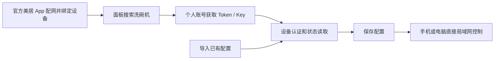

# 连接、配对与备份恢复

本指南适用于 Android 与 Python 1.1.0。入口均为右上角 **齿轮 → 设备**，支持 7600V1E0 / E1 / V3 / subtype 3。

## 连接方式

首次配对时，程序使用自己的美居账号请求设备 Token/Key，再向洗碗机认证。日常通信直接通过局域网 TCP 完成，不经过电脑中转，也不需要每次访问美居云端。

首次获取密钥需要互联网；设备必须绑定在登录账号下。真实账号流程尚未实测，账号验证或接口限制可能导致失败，不能承诺所有账号可用。已有密钥的实机局域网连接已验证。

## 首次配对

1. 在官方美居 App 中完成洗碗机配网，确认设备已绑定且在线。
2. 手机或电脑连接同一家庭局域网，避免访客 Wi-Fi 和客户端隔离。
3. 打开面板的设备页，点击“搜索局域网设备”，选择洗碗机。其他型号会显示暂不支持。
4. 输入自己的美居账号和密码，点击“登录并获取 / 更新密钥”。当前仅支持账号密码方式，验证码登录未实现。
5. 程序获取候选密钥，依次尝试设备认证与状态读取。通过后保存并重连；失败时保留原配置。
6. 返回主页查看实时状态，再按需要使用控制按钮。

界面不显示 Token/Key。密码只用于本次后台任务，不保存。Android 配置使用 Keystore 加密；Python 源码版配置保存在脚本同目录，Windows 可执行版保存在 EXE 同目录的 `dishwasher.json`。

## 导入已有配置

在设备页选择“导入配对 JSON”（Python 为“导入配置”），选择已有 `dishwasher.json` 或导出的备份文件。

两个版本使用兼容的 JSON 格式。示例为根目录 [dishwasher.example.json](../dishwasher.example.json)，其中空凭据和设备 ID 0 不能直接连接设备。

| 字段 | 要求 |
| --- | --- |
| `device_id` | 当前设备的非零 ID，最大 48 位整数 |
| `ip_address` | 设备可达的 IPv4 地址 |
| `port` | TCP 端口，通常为 6444，允许 1–65535 |
| `token` | 64 字节，写成 128 个十六进制字符 |
| `key` | 32 字节，写成 64 个十六进制字符 |
| `device_protocol` | 3 |
| `subtype` | 3 |
| `model` | 7600V1E0 |
| `device_type` | 可选；提供时必须为 225，即十六进制 E1 |
| `name` / `customize` | Python 可使用的名称／自定义参数；Android 导出不保留这两项 |

导入文件限 32 KiB。导入时会实际连接认证并读取状态，因此设备需要在线，文件中的 IP 也必须正确。认证失败不会覆盖现有配置。旧备份地址不可达时，可以在私人副本中修正 `ip_address` 后再次导入。

## 找回或修改 IP

路由器可能在设备重启后分配不同 IP。搜索返回的是局域网设备信息，**不会自动取得控制密钥**。

- 对已配置设备：搜索后选中相同设备 ID，地址会填入输入框；点击“保存地址并重连”。原 Token/Key 保留，验证通过才保存新地址。
- 对另一台设备：选中后需要登录其绑定账号获取密钥，不能借用上一台设备的密钥。
- 无广播结果：可在 IP 输入框填入已知地址后再次搜索；两个版本也会尝试对该地址发送发现请求。

地址自动变化后，当前版本不会自动后台发现并保存新 IP，需在设备页操作。可以在路由器为洗碗机配置 DHCP 地址保留，减少地址变化。

## 验证与更新密钥

“验证当前连接”使用**已保存的配置**进行认证和状态读取。它不会使用尚未保存的地址输入，也不会启动洗涤或改变开关。

“登录并获取 / 更新密钥”使用当前选中的设备和地址输入。云端返回新密钥后，只有通过设备验证才会替换原配置。

现有局域网 Token 通常没有定时过期机制，但不能保证永远可用：重新配网／配对可能让旧密钥失效，固件或协议变化也可能影响兼容性。云端停止签发新密钥不等于旧密钥立即失效。协议背景见 [midea-local 密钥缓存说明](https://github.com/midea-lan/midea-local/blob/main/README.md#command-line-tool)。

## 备份与恢复

1. 设备页点击“导出配置备份”（Python 为“导出备份”）。
2. 确认备份含 Token/Key，保存到私人目录。不要把文件上传到公开仓库、发到群聊或附在错误截图中。
3. 换手机、卸载重装或恢复配置后，在设备页导入备份。仍需同一局域网、有效地址与可用密钥。

备份 JSON 与 Python 本地配置为明文；Android 日常私有配置为加密文件。系统备份不会复制安卓配置，卸载后需要手动恢复。备份只含设备配对参数，不含美居登录密码。

## 常见问题

| 现象 | 检查与处理 |
| --- | --- |
| 手机提示 Wi-Fi 未连接 | 连接家庭 Wi-Fi。单独移动网络无法直连家庭洗碗机。 |
| 搜索不到设备 | 确认同一局域网、设备在线、路由器未启用客户端隔离；电脑防火墙也可能阻止发现。已知 IP 时填入后再次搜索。 |
| 找到了但暂不支持 | 当前仅支持指定型号和协议；发现设备不表示能够安全控制。 |
| 登录失败 | 检查账号密码及官方美居登录情况；验证码／风控验证或云端接口限制也可能导致失败。不要把密码或密钥贴到日志中。 |
| 登录成功但没有可用密钥 | 确认设备绑定在该账号下、设备 ID 和 IP 正确；接口可能不提供密钥。原配置仍保留。 |
| 连接超时 | 检查设备 IP、端口、供电和 Wi-Fi 隔离；先在设备页验证，地址改变时重新搜索。 |
| 认证失败 | 检查是否导入了另一台设备的配置；重新配网后可能需要获取新密钥。 |
| 安卓配置无法解密 | 用有效 JSON 备份重新导入；旧密文可能受系统密钥变化影响，不能直接跨手机复制。 |
| Python 启动失败 | 检查 Python 3.12+、Tkinter、依赖以及四个 Python 模块是否齐全；现有 JSON 损坏时先移到私人备份位置。 |
| 保管开启但显示当前未运行 | 保管开关与当前动作不同，查看“保管功能”和剩余小时，不以当前动作判断开关。 |
| 数值未上报或读数变灰 | 未上报不等于 0；灰色可能表示未知或断线，查看连接信息和更新时间。 |

当前版本不提供异地远程控制、验证码登录或其他洗碗机型号的适配。故障描述请包含平台、版本、操作步骤及界面提示，避免提交配对 JSON。
