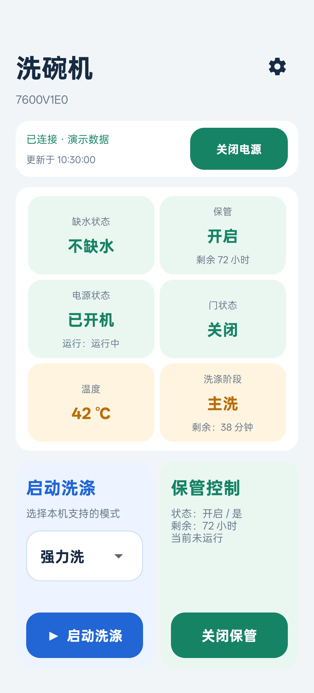
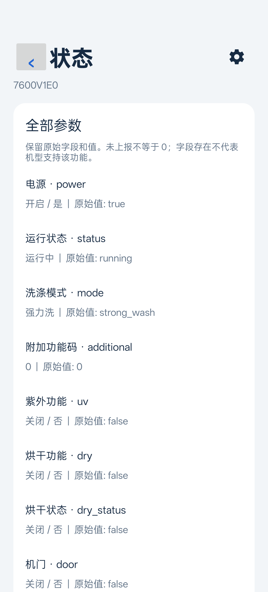
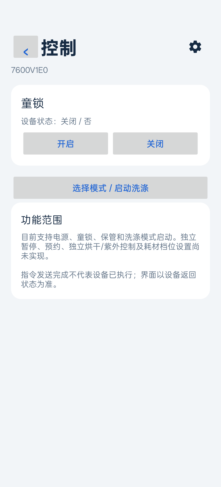
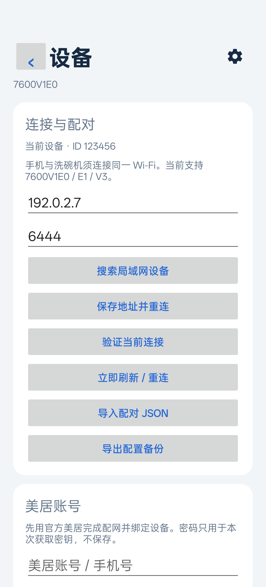
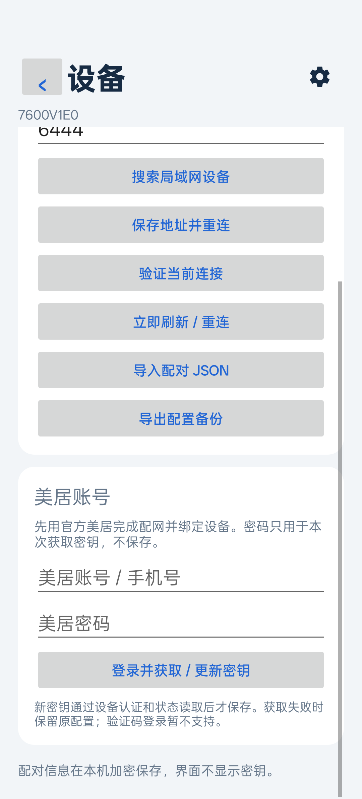
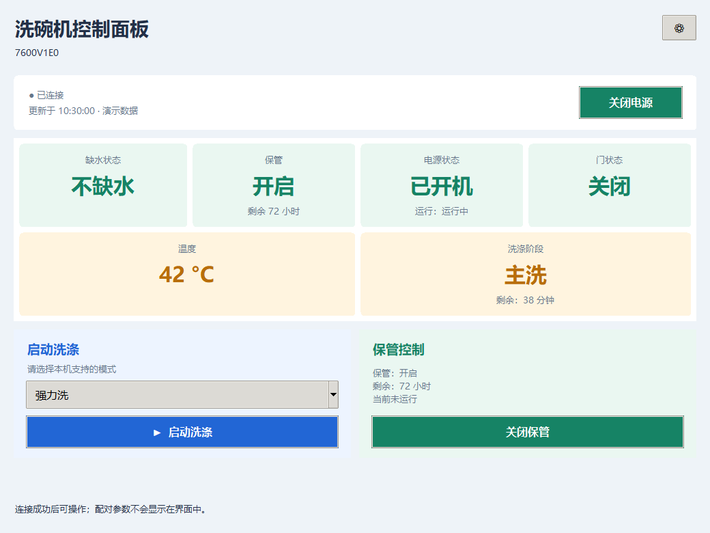
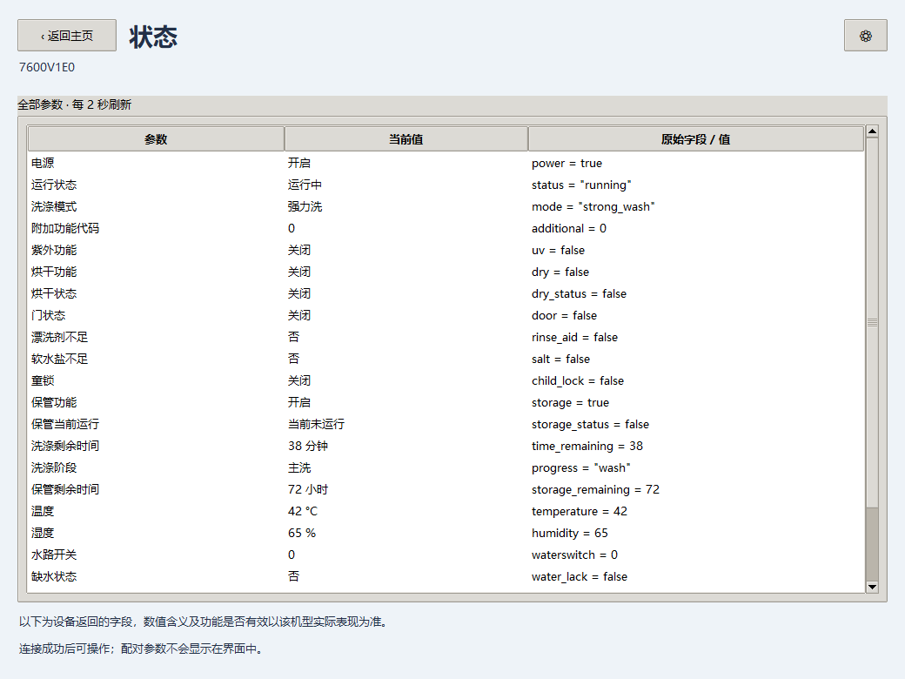
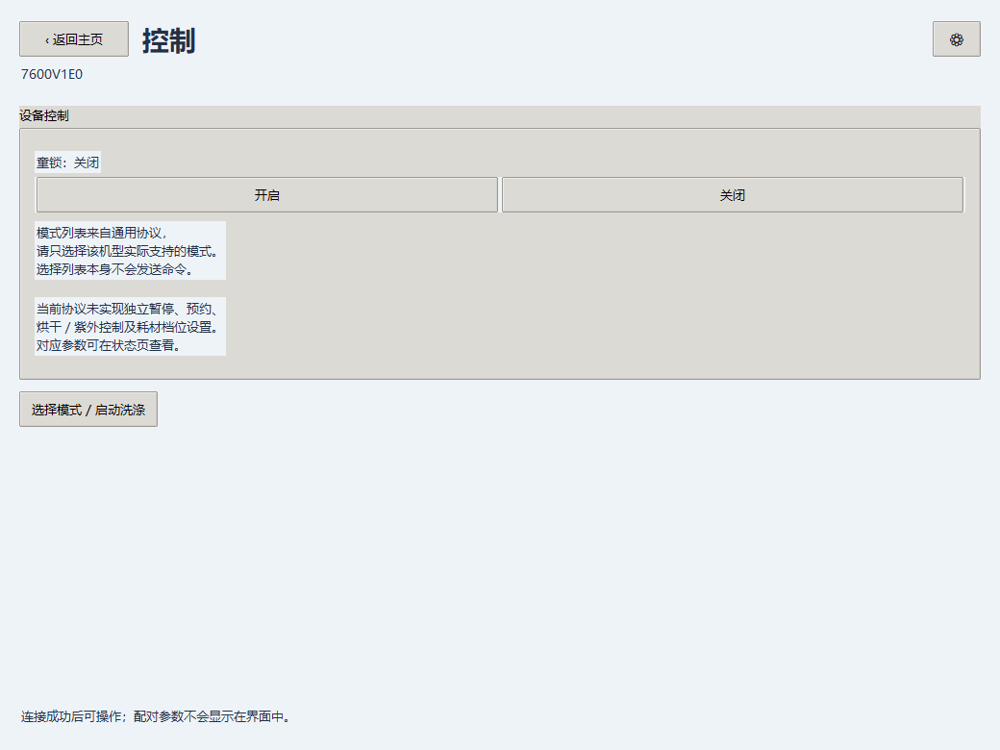
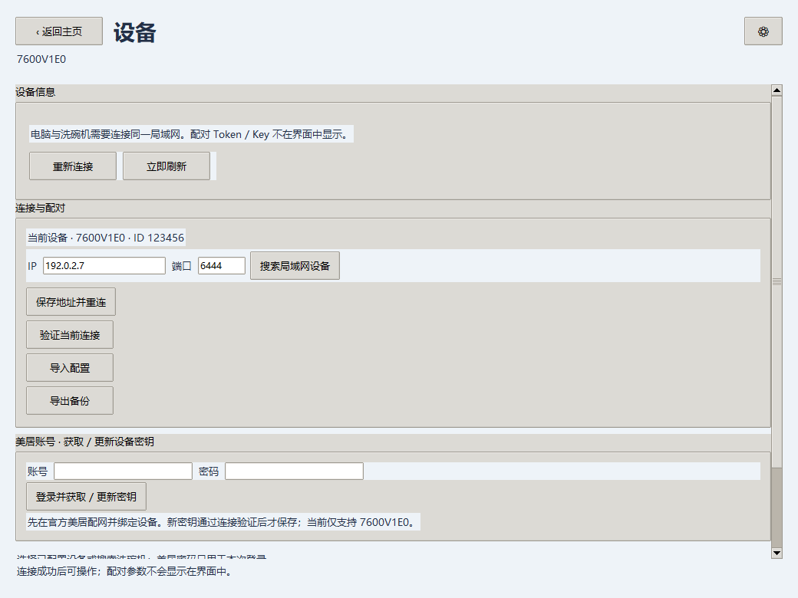

# 界面展示

展示图由当前版本的原生 Android 界面和 Tkinter 桌面界面渲染，统一使用演示数据：42℃、主洗、剩余 38 分钟、保管开启且剩余 72 小时。不连接或控制真实洗碗机，不写入演示配对配置。示例设备 ID 与地址均为虚构，账号密码为空。

## Android

默认主页展示连接、电源、六项重点状态和并列的洗涤／保管操作。右上角齿轮进入状态、控制、设备页；左上角或系统返回键回到主页。

| 主页 | 状态 | 控制 |
| --- | --- | --- |
|  |  |  |

| 设备与连接工具 | 美居配对入口（设备页下半部） |
| --- | --- |
|  |  |

## Python / Windows

桌面版与 Android 保持相同的状态含义和控制规则。桌面较宽，主页将四项状态横向排列；状态页以表格展示全部字段，设备页同时展示配对工具与操作记录。

### 主页



### 状态：全部参数



### 控制



### 设备：连接与配对



## 生成展示图

桌面端安装开发用 Pillow 后，在项目根目录运行 `python desktop/capture_preview.py`。脚本不启动网络线程，使用窗口截图生成四张图。需要可交互的图形桌面；Pillow 不是正常使用面板所需的依赖。

安卓端构建并安装测试 APK 后，显式运行以下方法；常规测试不会自动执行它：

```powershell
adb shell am instrument -w -e class com.topsai.dishwasher.PublicPreviewInstrumentedTest#capturePublicPreviews com.topsai.dishwasher.test/android.test.InstrumentationTestRunner
```

测试在 Activity 启动前使用只读的内存配置替身，避免读取私人配置或启动设备连接，随后填入临时演示状态。通过原生 View 绘制生成图片，保存在应用私有缓存 `cache/public-preview`。它不修改保存的真实配置、不提交账号信息，也不点击控制按钮。截图展示不代表真实云端配对或每一种洗涤模式已经实测；支持范围见 [项目首页](../README.md)。
